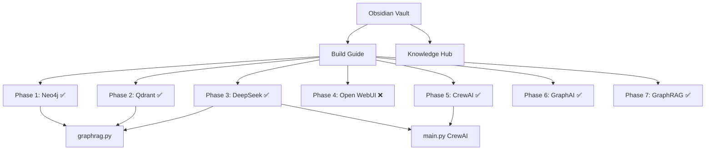

# 🧠 UAID AI — Knowledge Hub

> This is my "brain" for the UAID AI project. Every fact I know is linked from here.

## 🗺️ Navigation

- [[UAID - System Architecture]] — How everything connects
- [[UAID - Project Files]] — Every file and what it does
- [[UAID - Services & Credentials]] — URLs, ports, passwords
- [[UAID - What Works]] — Tested, verified, operational
- [[UAID - Gotchas & Pitfalls]] — Things that broke and how I fixed them
- [[UAID - Hermes Brain Dump]] — What Hermes remembers across sessions
- [[UAID - Build Status]] — Live progress tracker
- [[UAID - Component Audit & Upgrades]] — 🔬 Deep audit of every component
- [[Loop Engineering]] — Agent orchestration patterns & tools
- [[CS249r - ML Systems]] — Harvard ML systems engineering curriculum
- [[Top GitHub Repos for UAID]] — Best repos to level up UAID
- [[Top 100 GitHub Skills for AI]] — 100 skills for self-evolving AI agents
- [[UAID AI - Complete Build Guide]] — Original 9-phase plan

## ⚡ Quick Facts

- **Project path:** `C:\Users\x47th\OneDrive\Desktop\biiiiiiiiiiiiigggggggggg labbbbbbbbbbbbb\uaid_agents\`
- **Vault:** `big lab` in Obsidian
- **OS:** Windows 10, bash via git-bash/MSYS
- **Python:** 3.11.15, packages via pip (not uv for project deps)
- **Docker:** `C:\Program Files\Docker\Docker\resources\bin\docker.exe` (v29.6.1)
- **Node.js:** v22.23.1
- **Shell:** POSIX syntax (bash), NOT PowerShell

## 🔗 Connections

